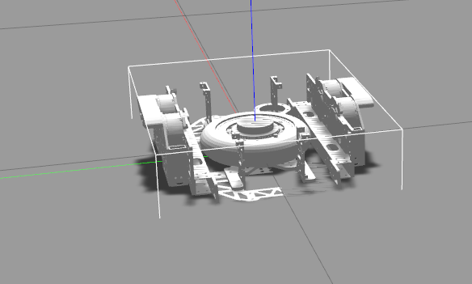
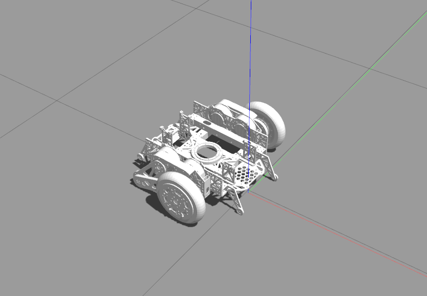

# balance_sim
simulation for balance robot

`ros2 launch balance_description view_robot.launch.py`

rviz查看机器人模型

`ros2 launch balance_description gazebo_control.launch.py`

启动gz仿真，使用gz的hardware_interface

`ros2 launch balance_bringup balance.launch.py`

启动自己的接口，需要将`balance_control.xacro`的硬件插件改为自己写的，并且注释下面`gazebo`的插件

`ros2 launch balance_description import_gazebo.launch.py `

将模型导入gazebo中

`pkill -9 gzclient` `pkill -9 gzserver`杀`gazebo`

## 问题

1. `rviz`和`gazebo`加载模型的路径不统一

   使用`<xacro:property name="mesh_path" value="file://$(find balance_description)/meshes"/>`

2. 启动自己的接口时，能加载进去，但是机器人模型散架

   加载进去的时候关节范围不是统一在-pi到pi，可能出现了2pi到4pi

3. 使用`gazebo`硬件接口时模型在rviz中乱动，但是gazebo中不显示，过一会后模型叠加在原点

4. 模型加载进去但不加载控制器

   libgazebo_ros2_control.so要在ros2_control外面

4月28日，它终于安静的躺在那了

